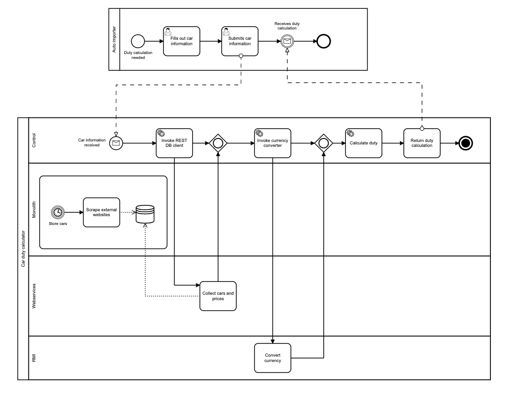
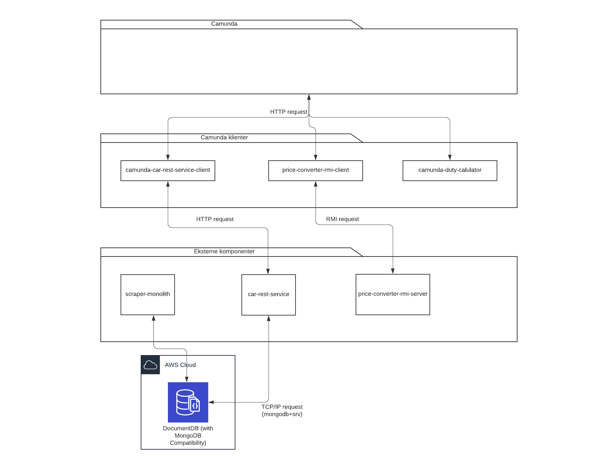

# Systemintegration eksamensprojekt 2020

#### Mads Wulff Nielsen cph-mn492@cphbusiness.dk

#### Claus Kramath cph-ck83@cphbusiness.dk

- ## Introduktion:
  Kerneprocessen i vores service kan finde bildata på danske og udenlandske brugtbilsplatforme og på baggrund af disse beregne et estimat af den danske registreringsafgift ved import af et lignende køretøj.

- ## BPM:

- ## Arkitektur:

* **Monolit**\
  Hver brugtbilsplatform undersøges vha. såkaldte scrapers som traverserer et HTML-baseret søgeresultat og samler relevante data for en given bilmodel.\
  Denne service er etableret som en monolit applikation som opdaterer en bildatabase en gang i døgnet.\
  Servicen henter søgekriterier fra databasen, udfører disse og lagrer resultaterne. Ideen er, at mængden af søgekriterier udvides efterhånden som der søges. Videre er ideen, at uddaterede søgeresultater fjernes fra databasen baseret på givne kriterier.\
  Hver scraper kører i egen tråd.

* **Uafhængige komponenter**
   * **Car REST service**
        Udstiller et API for metoder der tilgår databasen, som monoliten vedligeholder. Dette API kan levere en liste af biler baseret på søgekriterier.\
        API dokumentation:

          GET: /car/{manufacturer}/{model}/{year}/{km}

    * **Price converter RMI server**
  Da bilerne i systemet har forskellig valuta, har vi etableret en service der kan omregne disse til den ønskede valuta, pt. dansk.\
  Denne service benytter et offentligt API til at få valutakurser:

          GET: https://api.exchangeratesapi.io/latest?base={currency}

      I denne service findes en implementation af RmiInterface, som udstiller flg. metode:

          public Map<String, Map<String, Object>> calculatePrice(Map<String, Map<String, Object>> object, String targetCurrency) throws Exception
      Da servicen ikke kender typen af objekter, der arbejdes på, må disses enten loades dynamisk eller overføres simple datatyper.\
          Vi har valgt sidstnævnte tilgang og mappet bilen til flg. struktur:

          {
              ID: String
              {
                  price: Double
                  currency: String
              }
          }
      Data returneres i samme struktur med omregnet pris og ændret valuta.

  * **Camunda klienter**
    * **Camunda car REST service client**
    Dette komponent danner bindeled mellem Camunda og car REST service.\
  Dets ansvar er således at modtage bilsøgekriterier fra Camunda og sende dem til REST API'et og efterfølgende modtage en liste af biler og sende denne til Camunda.

    * **Camunda price converter RMI client**\
          Denne komponent danner bindeled mellem Camunda og price convert RMI serveren.\
          Opgaven består i af modtage en liste af biler, pakke relevante data (pris og valuta) ud af denne og sende disse til RMI serveren for omregning.\
          Når data foreligger fra RMI serveren, skal disse lægges tilbage i den oprindelige liste af biler, så de omregnede priser fremgår.\
          Listen sendes herefter tilbage til Camunda.
    * **Camunda duty calculator**\
          Denne komponent er udviklet i Python.\
          Opgaven består i af beregne den estimerede registreringsafgift baseret på de bildata der modtages fra Camunda.\
          På nuværende tidspunkt er beregningen relativ simpel, idet den blot subtraherer snitpriser baseret på bilens oprindelsesland.\
          En ide til udvidelse kunne være muligheden for at sende en beregningsmodel med ind i systemet.

Opdelingen i eksterne komponenter og Camunda klienter er lavet på baggrund af ideen om at sætte de eksterne komponenter i stand til at fungere med alternative Middleware systemer.

- ## **Docker**
  Der er etableret Docker images af de forskellige komponenter, så de kan deployes i Docker containere. Images kan hentes fra:

          https://hub.docker.com/u/cphmn492

  For at samle alle images og sikre at de starter i hver sin container og kommunikerer på samme netværk, har vi lavet en docker-compose.yml. Når din Docker desktop kører, kan den startes vha.:

          docker-compose pull
          docker-compose up

- ## **Orkestrering og koreografi**
   Projektet benytter Camunda til orkestrering af processens forskellige handlinger. Det er således Camunda der, på baggrund af vores BPM afgør, i hvilken rækkefølge, handlingerne udføres.\
   Der er tale om en orkestrering, da alle handlinger er afhængige af hinanden; ingen kan kaldes parallelt. Vi kunne dog have designet price-converter-rmiclient'en således, at den blot hentede valutakurser uanset hvilken målvaluta der ønskes. Den ville da ikke have været afhængige af en liste af biler.\
   Vores price-converer-rmiservice komponent er allerede klar til dette scenarie, da denne blot kræver en targetCurrency.\
  Orkestrering sker videre ved hjælp af docker-compose, som sørger for at starte de containere, applikationen kræver.\
   I docker-compose.yml kan man specificere hvordan fejlhåndtering sker. I vores tilfælde har vi, ved hver service, sat flg. property:

          restart: on-failure

  Af vores BPM fremgår, at vi har haft fokus på integrationer mellem komponenterne. Derfor er der ikke indtegnet alternative flows gennem applikationen som følge af manglende data eller øvrige fejl.

  I BPM kan man opstille prædikater som kan afgøre, hvilket flow der følges.
